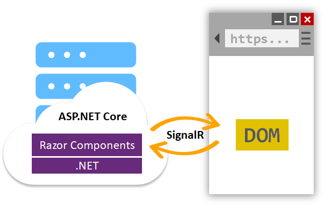

# **Blazor**

## For fun and profit

---

# Gameplan

- History lesson
- Crash course
- Workshop

---

# Web Apps can't really do _that_, can they?

- Steve Sanderson [(@stevensanderson)](https://twitter.com/StevenSanderson)
- Microsoft developer in the ASP.NET team

[NDC Oslo 2017: 
Web Apps can’t really do *that*, can they?](https://www.youtube.com/watch?v=MiLAE6HMr10)

---

<!-- - 

Steve Sanderson

- Steve Sanderson
- Currently a dev in the ASP.NET team
- Previously worked on the Azure Portal and various JavaScript frameworks
- Started the `knockout.js` project that Stiletto/WIWO is written in
- Is talking at [Steve Sanderson | NDC Sydney 2024](https://ndcsydney.com/speakers/steve-sanderson)

- NDC Oslo in June 2017 
- Service workers and other things with the React template

-->
---

# Blazor 101

Blazor is a web framework that enables developers to create interactive web apps using C# and HTML.

- Built on the ASP.NET Core framework
- Component based UI using Razor syntax
- Share classes and services between the server and UI
	
---

# Blazor Flavours

Different hosting models to suit all situations

- [Server](#6)
- [Web Assembly (WASM)](#7)
- [Hybrid](#8)
- [United](#9)

---

# Blazor Server

App hosted on an ASP.NET Core server where the browser acts as a thin client.

- [SignalR](https://learn.microsoft.com/en-us/aspnet/core/signalr/introduction) connection is setup between the browser and the server
- Actions in the UI (button clicks, navigation etc) are sent to the server
- Server calculates the diff in the HTML and sends the result back to the browser

<!-- 
Good
- Easiest to get started with
- Everything is on the server so less risk of leaking code
- Quick startup

Bad
- Requires an internet connection at all time
- Can lag if there are too many events being fired
- Can struggle under large loads as each user has a connection active 
-->

---

# Blazor Web Assembly

Single page apps (SPA) that run on the client browser using WebAssembly (WASM).

- Application is compiled into .NET assemblies
- Assemblies and the .NET runtime are downloaded to the client on first request
- Blazor WASM configures the runtime and uses JavaScript to manipulate the DOM and make API calls

<!-- 
WebAssembly is an open web standard and supported in web browsers without plugins. WebAssembly works in all modern web browsers, including mobile browsers.

Good
- Low latency
- Can run offline
- Can be setup as a PWA out of the box

Bad
- Slow inital startup as the framework is downloaded

-->

---

# Blazor Hybrid

- Uses web technologies in a native app
- Renders components in the UI with an embedded Web View control
- Available with MAUI, WPF and WinForms

---

# Blazor United

Why choose between Server and WASM when you can have both?

- Currently part of the .NET 8 previews
- Allows choosing how specific components are rendered
- Essentially magic

[Blazor United prototype - Steve Sanderson](https://www.youtube.com/watch?v=48G_CEGXZZM)

---

# Getting Started

Install the following VS workloads to get access to the Blazor projects:

### Server & WASM
- `ASP.NET and web development`

### Hybrid
- MAUI: `.NET Multi-platform App UI development`
- WPF & WinForms: `.NET desktop development`

---

# Exploring a Blazor App

---

# Workshop

- Build a website that is able to manage user and store details
- Jump over to the [wiki](https://github.com/hjbwallace/BlazorWorkshop/wiki) for further instructions
- Open `StoreAdmin - Workshop.sln` and get building!